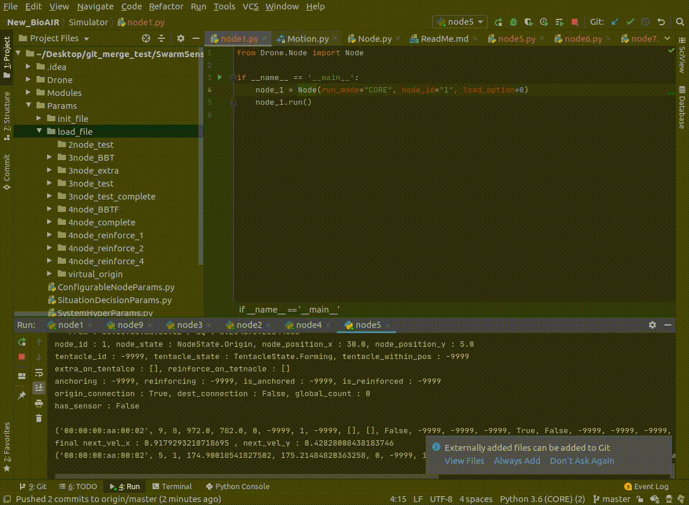

# BIOAIR
  SwarmSense - Episys Science Inc.
  
- Bioair algorithm simulator
- SwarmSense module  
  
  
  
# How To Simulate
  
Description for how to simulate/run 
 * [Quick Tutorial Video - simulation on CORE](https://youtu.be/WWjVPhFlrtk)
## Node Initialization 
```
node = Node(run_mode="CORE", node_id="1", load_option=0)
node.run()
```
When you create a node, make node_id = {node_id} and load_option **0**.  
the node instance read the CNP,SDP,SHP in the Params/init_file to initialize the node.  
The path and file of the initialization files are as follows.

```
init_files_directory = Params/init_file
{init_files_directory}/node_{node_id}_CNP.ini 
{init_files_directory}/node_{node_id}_SDP.ini 
{init_files_directory}/node_{node_id}_SHP.ini
```

  
## Node Save  
  
  
  
When you exit the node process, the parameters values of the current node are stored in Params/load_file. 
The path and file to be saved are as follows.
  
```
load_files_directory = Params/load_file
{init_files_directory}/node_{node_id}_CNP.ini 
{init_files_directory}/node_{node_id}_SDP.ini 
{init_files_directory}/node_{node_id}_SHP.ini
```
 
## Node Load  
```
node = Node(run_mode="CORE", node_id="1", load_option=1)
node.run()
```

When you create a node, make node_id = {node_id} and load_option **1**.  
Read the CNP,SDP,SHP in the Params/load_file to initialize the node.  
The path and file of the load files are as follows.

```
load_files_directory = Params/load_file
{init_files_directory}/node_{node_id}_CNP.ini 
{init_files_directory}/node_{node_id}_SDP.ini 
{init_files_directory}/node_{node_id}_SHP.ini
```

## With CORE 6.3.0 (+ SDT3D)
Docs for Common Open Research Emulator
* [CORE 6.3.0 installation](./README/Core%206.3.0%20Installation.md)
* [SDT3D&STDCMD Installation](./README/SDT3D%26STDCMD%20Installation.md)
* [Core & SDT3D & SDTCMD Document](./README/Core%20%26%20SDT3D%20%26%20SDTCMD.md)
# Documentations 
  
Class Documentations
  
* **Drone**

| Class | Description |
|---|---|
| Node | Main class, The real drone has one this node class instance. |
| Destination | Destination Node class for simulation.|
| Origin | Origin Node class for simulation.|
| State (Enum Class) | NodeState, TentacleState is defined as enum class. |
* **Modules**

| Class | Description |
|---|---|
| Communicator | Update data structure with information about adjacent nodes, Calculate profile and Update parameters for the Bioair algorithm.|
| Motion |Based on the information updated by the Communicator, Command the drone to move to the next location calculated by the BioAir algorithm.|
* **Sub Modules**

| Class | Description |
|---|---|
| Message | Messages sent and received between nodes. Make the class json object and Communicate it using UDP BroadCast. |
| ProfileGenerator | Calculate the Profile according to the conditions and formulas defined by the algorithm. |
| StateController | Manage State change. |
* **Params**

| Class | Description |
|---|---|
| SystemHyperParameters | Parameters that can affect the performance of the system, these values do not change during execution.|
| SituationDecisionParameters | Parameters that needed to compute the Bioair algorithm. |
| ConfigurableNodeParameters | Parameters that are mainly initialization-related variables such as starting location information, sensor status, etc., which depend on Drone's Spec.|
  
  
# Threads  
  


Message handling 

 1. Message Receive
 2. Calculate profiles & Update Situation Decision Parameters
 3. Update State

Move Command

 1. Send move command to each node 

Message Send

 1. Send new broadcast messages

**And this will produce a flow chart:** 
 


  
## More about 
  
[The specification document](https://docs.google.com/presentation/d/1RRpPYpo1SYcAg3p6uRiLG_Vk5xtQTLHOOGk5UQG3RoM/edit#slide=id.p1) is uploaded on Episys Science Google Drive

You can find more details of this project.
- Assumption for BioAir algorithm
- All Parameters description
- Message Protocols
- State Transition
- Math formulas for BioAir Profiles(Fields)
- Use case(Scenario)
- UML 

[Handover Document](https://docs.google.com/presentation/d/1vLxhuoAuhWju66NC413iAarajFFkYxmlSkdguR8xaog/edit?usp=sharing)
- Parameters description
- Message Protocols
- Profiles
- Structure
- Manage State
- Develop Progress
- UML
- **State Controller Conditions Description**
- [Final PT](https://drive.google.com/file/d/1AJv11BVdUKNXMabEeCWy71HwCzSXGfn7/view?usp=sharing)